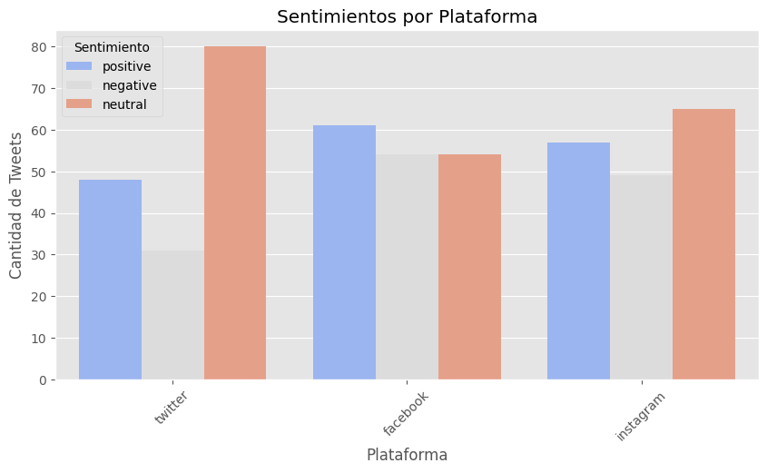

# Análisis de sentimiento con Machine Learning

Este proyecto aplica Machine Learning para el análisis de sentimiento utilizando un modelo de regresión logística. Se procesan datos textuales, se limpian y transforman, y se entrena el modelo para clasificar los sentimientos en positivo, negativo o neutral en distintas plataformas.

  

